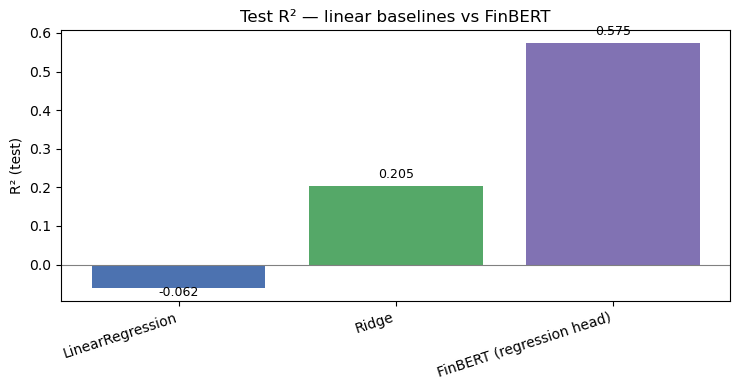
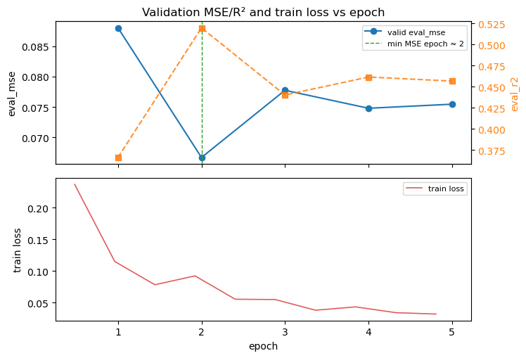

#  FinBERT × FiQA — Financial Sentiment Regression

> Fine-tune **FinBERT** (`ProsusAI/finbert`) with a **regression head** on the **FiQA** dataset to
> score financial text sentiment as a continuous value, benchmark it against TF-IDF baselines and
> several **LoRA** variants on a fair, locked-budget protocol, and finish with a live demo that
> ranks real news headlines from most positive to most negative.

Single-notebook deliverable: [`notebookFT.ipynb`](./notebookFT.ipynb)

---

## Why this matters

Most off-the-shelf financial sentiment models predict three discrete classes (positive / neutral / negative).
That is fine for dashboards but too coarse for **ranking and screening** tasks like *"which 10 of these 200
headlines should I look at first?"* — anything labeled "positive" is a tie. A continuous regression score
preserves intensity, which is exactly what downstream applications (news triage, signal aggregation,
event-driven alerting) need. The **FiQA-2018 sentiment** dataset already ships continuous targets
(≈ −1 … +1) on real financial text, so it is the natural setting to train and evaluate this kind of
model end-to-end.

---

## Highlights

- **Cuts the strongest classical baseline nearly in half**: test MSE **0.133 → 0.073**, R² **0.205 → 0.565**.

- Empirically pins down a non-obvious training recipe — **3-epoch cosine** beats both 2 and 5 epochs
  on this schedule; evidence in the validation curve below.

- A **fair LoRA suite** (K-fold CV, mini grid, long-context, 2-seed ensemble) sharing one epoch budget
  with the full fine-tune, so every row in the results table is comparable by construction.

- An **end-to-end inference demo**: best checkpoint scores live news headlines for a 10-ticker watchlist
  and ranks them; works fully offline from a local CSV when needed.

  

---

## Dataset & setup

- **Dataset:** [`TheFinAI/fiqa-sentiment-classification`](https://huggingface.co/datasets/TheFinAI/fiqa-sentiment-classification)
  (FiQA-2018 Task 1), continuous sentiment scores on financial news headlines and microblog posts.
- **Target:** continuous score in roughly `[-1, +1]`. Modeled as **regression**, not classification.
- **Scale:** small — about **800 train**, 100 valid, and 235 test rows after the official split.
  This is the regime where parameter-efficient methods (LoRA) are *expected* to be most competitive,
  which makes the comparison with full fine-tuning informative rather than foregone.
- **Backbone:** `ProsusAI/finbert` (BERT-base, financial-domain pre-trained, ~110 M params), with
  the original 3-class head replaced by a 1-D linear regression head.

---

## Results

| #    | Model                                                    | Eval split     | MSE ↓        | R² ↑         |
| ---- | -------------------------------------------------------- | -------------- | ------------ | ------------ |
| 1    | TF-IDF + Linear Regression                               | test           | 0.178        | −0.062       |
| 2    | TF-IDF + Ridge                                           | test           | 0.133        | 0.205        |
| 3    | **FinBERT-FiQA regressor — full fine-tune, 3-ep cosine** | **test**       | **0.073**    | **0.565**    |
| 4    | LoRA — K-fold CV (3 folds)                               | held-out folds | 0.199 ± 0.06 | −0.26 (mean) |
| 5    | LoRA — mini grid best (`lr=3e-5, wd=0.01`)               | validation     | 0.089        | 0.362        |
| 6    | LoRA — long-context (`max_length=256`)                   | validation     | 0.089        | 0.359        |
| 7    | LoRA — 2-seed ensemble (42 / 43)                         | test           | 0.097        | 0.417        |

**Verdict.** Row 3 wins on every comparable metric. The full fine-tune nearly halves test MSE versus the
strongest classical baseline (0.133 → 0.073) and lifts test R² from 0.21 → 0.57. The 2-seed LoRA
ensemble (Row 7) trails by ≈ 0.024 MSE / 0.15 R² — a meaningful gap on this dataset, but at 3–5× lower
training cost it remains a sensible fallback when compute is the bottleneck.

> Rows 4–6 are LoRA diagnostics on training folds or the validation split, included to show fold
> stability, hyperparameter sensitivity, and that 128-token context is already sufficient for FiQA.
> They are not directly comparable to the test-split rows.

---

## Method

```
                FiQA continuous sentiment scores  (≈ −1 … +1)
                           │
   ┌───────────────────────┼───────────────────────────────────┐
   │                       │                                   │
TF-IDF                FinBERT backbone                  LoRA adapters
+ Linear/Ridge   → swap classification head →           on Q/V projections
(closed-form         1-D regression head                (~0.3 % trainable)
 baselines)          (~110 M params, full FT)
                           │
                  3-epoch cosine schedule
                  (lr = 2e-5, wd = 0.01, warmup = 0.1,
                   load_best_model_at_end on eval_mse)
                           │
                Best checkpoint → news ranking demo
                  (Google News RSS / NewsAPI / local CSV)
```

- **Loss / metrics:** MSE training objective; reported as MSE, MAE, and R² on the official FiQA splits.
- **Selection:** `load_best_model_at_end=True` on `eval_mse`, so the deployed checkpoint is always the
  lowest-validation-MSE epoch, not the last one.
- **Locked LoRA budget:** every advanced row uses one shared knob (`EPOCH_DEFAULT = 3`), so each variant
  sits on the same cosine schedule length as Row 3 — the comparison is apples-to-apples by construction.

### Why 3 epochs (and why not 2)



Validation MSE bottoms out near epoch 2 on a 5-epoch run — but setting `NUM_EPOCHS = 2` *directly*
does not reproduce that checkpoint. With ~104 total optimizer steps, the cosine schedule decays the
LR to ≈ 0 before the model has seen enough data, and validation regresses. **Three epochs is the
smallest budget at which cosine has room to reach a useful low-LR phase without letting epochs 4–5
drift upward.**

---

## Quick start


```bash
pip install -U transformers torch datasets accelerate peft \
               scikit-learn pandas numpy matplotlib jupyter

jupyter lab "notebookFT.ipynb"  # then Run All
```

End-to-end runtime: **~10 min** on an 8 GB+ NVIDIA GPU, **~20–30 min** on Apple Silicon (MPS).
First execution downloads the FinBERT weights and the FiQA dataset from the Hugging Face Hub;
subsequent runs use the local cache.

### Reproducibility

- Seeds are fixed at the top of the modeling section (`SEED = 42` for `torch` and `numpy`); the
  Hugging Face `Trainer` also defaults to seed 42 for shuffle order. Numbers can still jitter by
  ~±0.005 across machines (CPU / MPS / CUDA, PyTorch version) — bitwise GPU determinism is not enforced.
- The numbers in the **Results** table come from a single canonical 3-epoch run dumped to
  [`_fill_table_results.json`](./_fill_table_results.json) for traceability.
- Both figures in this README are exported from the notebook's actual outputs (`figures/`); the
  notebook is the source of truth, the README does not contain any results computed elsewhere.

---

## Downstream demo: ranking live news

The last cell loads the best checkpoint, pulls headlines for a 10-ticker watchlist
(AAPL, MSFT, NVDA, JPM, TSLA, GS, RKLB, BA, LMT, RTX) from Google News RSS, scores them with the
regression head, and sorts from most positive to most negative.

Sample output from one real run:

| Rank   | Ticker | Headline (truncated)                                         | Score     |
| ------ | ------ | ------------------------------------------------------------ | --------- |
| Top 1  | MSFT   | Microsoft stock climbs in historic multi-day rally           | **+0.56** |
| Top 2  | NVDA   | Nvidia Just Piled $2 Billion Into This Chip Stock…           | **+0.54** |
| Top 3  | NVDA   | Nvidia stock is on a 10-day winning streak…                  | **+0.54** |
| …      |        |                                                              |           |
| Bot. 3 | TSLA   | Tesla Stock Slips as Tesla Packages Insurance With FSD       | **−0.59** |
| Bot. 2 | LMT    | Lockheed Martin (NYSE:LMT) Trading Down 2.6% — What's Next?  | **−0.66** |
| Bot. 1 | BA     | Boeing shares slide as investors refocus on near-term delivery uncertainty | **−0.63** |

The ordering is consistent with a human read of the headlines and demonstrates that the regression
head transfers cleanly from FiQA's annotated text to in-the-wild financial news.

To run the demo **fully offline**, copy `headlines.sample.csv → headlines.csv` and set
`HEADLINES_CSV = "headlines.csv"` in the demo cell. If that path is not used, the cell falls back
gracefully (Google News RSS → optional NewsAPI → built-in mini sample), so it always completes.

---

## Repository structure

```
.
├── notebookFT.ipynb               # main deliverable, run top-to-bottom
├── headlines.sample.csv           # offline input for the news-ranking demo
├── figures/                       # plots used in this README, exported from notebook outputs
├── _fill_table_results.json       # canonical 3-epoch metrics behind the Results table
├── finbert_fiqa_regression/       # full fine-tune checkpoints (created on first run)
├── finbert_fiqa_regression_rerun/ # canonical 3-epoch retrain checkpoints
└── adv_lora_*/                    # LoRA K-fold / grid / long-context / ensemble outputs
```

---

## Key findings

1. **Domain pretraining + regression head ≫ TF-IDF.** Sparse lexical features cap out near R² ≈ 0.21;
   FinBERT lifts test R² to 0.57 because it actually represents financial semantics (earnings beats,
   downgrades, guidance) that drive the labels.
2. **Cosine LR ties effective training length to total epochs.** A "best epoch ≈ 2" reading on a long
   schedule does not mean "train for 2 epochs"; on small datasets, under-training is the more common
   failure than overfitting.
3. **LoRA is a robustness/efficiency tool here, not a precision challenger.** With ~800 training rows,
   a 0.3 %-parameter adapter cannot match the signal a 110 M-parameter full fine-tune captures, even
   with seed averaging.
4. **128-token context is already enough for FiQA.** Long-context (256) ties the short-context run on
   validation — the dataset is short headlines, so truncation is not the bottleneck.

---

## Practical relevance

- **News triage:** rank a daily firehose of headlines so analysts read the most positive / negative
  ones first instead of clicking through chronologically.
- **Signal aggregation:** continuous scores can be averaged across headlines per ticker per day to
  produce a finer-grained sentiment series than a 3-class label permits.
- **Cheap iteration on new domains:** the LoRA recipe (Row 5 config) trains in a fraction of the
  full-FT time, making it a practical first step when porting this setup to a new financial corpus.

---

## Caveats & limitations

- **Reported numbers are FiQA-test metrics**, not real-world trading performance. The news-ranking
  demo is an illustrative downstream application, not a backtest or trading study.
- Numbers in the table jitter by ~±0.005 across machines (CPU / MPS / CUDA, PyTorch version, shuffle
  order). The ranking of models is stable.
- Row 4's negative R² is a small-fold artifact (~270 samples per held-out fold); read it alongside
  the per-fold MSE rather than in isolation.
- LoRA Rows 5–6 are evaluated on `validation`, not `test`. The directly comparable validation MSE
  for Row 3 is 0.071 — still ahead of both.

---

## Stack

`transformers` · `peft` (LoRA) · `datasets` · `scikit-learn` · `pandas` · `matplotlib` ·
PyTorch (CUDA / MPS / CPU)
